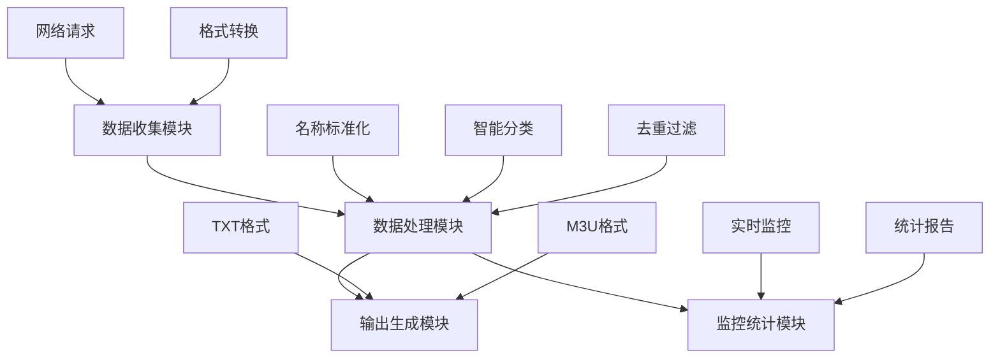

# 📺 直播源处理

## 📋 项目概述

核心功能

一个功能完整的直播源处理系统，专门用于从多个网络源收集、整理、分类和去重电视直播频道数据，生成多种格式的输出文件供播放器使用。

技术特点

- 多源采集：支持从多个网络源自动获取直播数据
- 智能分类：基于频道名称自动分类到50+个精准分类
- 质量管控：多重去重机制和质量过滤
- 多格式输出：生成TXT和M3U格式，兼容主流播放器

## 🏗️ 系统架构

模块化设计



## 功能模块说明

1. 数据收集模块

- 网络请求管理：带重试机制的HTTP请求
- 格式自动识别：M3U/TXT格式自动转换
- 动态变量处理：日期变量自动替换

2. 数据处理模块

- 数据清洗：频道名称标准化、繁简转换
- 智能分类：基于字典的精准分类
- 质量控制：去重、黑名单过滤、白名单优化

3. 输出生成模块

- 多版本输出：完整版、精简版、定制版
- 格式转换：TXT转M3U，集成Logo和EPG
- 文件验证：输出文件完整性检查

4. 监控统计模块

- 实时进度：处理状态实时显示
- 性能统计：执行时间、频道数量统计
- 质量报告：去重效果、分类分布分析

## 📁 目录结构

输入目录结构

```
scripts/livesource/
├── blacklist/              # 黑名单管理系统
│   ├── blacklist_auto.txt     # 自动收集的无效URL
│   ├── blacklist_manual.txt   # 手工维护的永久黑名单
│   └── whitelist_auto.txt     # 高速响应源白名单
├── 主频道/                  # 主要频道分类字典
│   ├── CCTV.txt              # 央视频道标准名称
│   ├── 卫视频道.txt          # 卫视频道标准名称
│   ├── 新闻频道.txt          # 新闻类频道
│   ├── 电影频道.txt          # 电影类频道
│   └── ...其他23个分类
├── 地方台/                  # 地方频道字典（27个省份）
│   ├── 北京频道.txt
│   ├── 上海频道.txt
│   ├── 广东频道.txt
│   ├── 江苏频道.txt
│   └── ...其他23个省份
├── 手工区/                  # 手工维护的高质量源
│   ├── 港澳台.txt           # 港澳台地区频道
│   ├── 优质央视.txt         # 高质量央视频道
│   ├── 优质卫视.txt         # 高质量卫视频道
│   ├── about.txt           # 项目说明
│   ├── AKTV.txt           # AKTV特殊源
│   ├── 今日推荐.txt         # 每日推荐频道
│   └── 今日推台.txt         # 推荐频道源
└── urls-daily.txt          # 每日更新的源URL列表
```

输出目录结构

```
output/livesource/          # 生成文件输出目录
├── full.txt               # 完整版：所有分类+更新信息
├── lite.txt               # 精简版：主要频道
├── custom.txt             # 定制版：主要频道+更新信息
├── others.txt             # 其他源：未分类频道
├── full.m3u               # 完整版M3U格式
├── lite.m3u               # 精简版M3U格式
└── custom.m3u             # 定制版M3U格式
```

## 🔧 核心功能详解

1. 数据收集与处理

网络请求机制

```python
def get_http_response(url, timeout=10, retries=3, backoff_factor=1.5):
    """
    智能HTTP请求函数
    参数:
        timeout: 请求超时时间(秒)
        retries: 最大重试次数
        backoff_factor: 指数退避系数
    """
```

核心特性：

- ✅ 智能重试：采用指数退避算法，避免请求过快被封锁
- ✅ 超时控制：10秒超时保证处理效率，避免长时间阻塞
- ✅ 错误分类：区分HTTP错误、网络错误、超时等不同情况
- ✅ 用户代理：模拟真实浏览器请求，避免被服务器屏蔽

URL源处理特性

- 动态日期替换：自动处理 {MMdd}、{MMdd-1} 等日期变量
- 格式自动识别：智能识别M3U格式并自动转换为标准TXT格式
- 多源加速：支持 # 分隔的多个URL加速源，提高访问成功率
- 协议过滤：自动跳过UDP、RTSP等不稳定协议

2. 频道数据处理

名称标准化系统

```python
def clean_channel_name(channel_name, removal_list):
    """频道名称标准化处理"""
```

清理规则：

- 移除冗余标识：_电信、高清、频道、-HD、-BD等
- 统一后缀处理：智能移除多余的HD、台等后缀
- 繁简转换：自动将繁体中文频道名称转换为简体中文
- 特殊格式处理：CCTV频道、卫视节目的特殊命名规则

## 智能分类系统

脚本支持 50+个精准分类，主要包括：

🌐 主频道分类（2个）

- 央视频道 (CCTV系列)：CCTV1-CCTV17, 4K/8K超高清频道
- 卫视频道 (各省卫视)：湖南卫视、浙江卫视、江苏卫视等

☘️ 地方台分类（27个省份）

- 直辖市：北京频道、上海频道、天津频道、重庆频道
- 省份频道：广东、江苏、浙江、山东、河南、四川等
- 自治区频道：新疆、西藏、内蒙古、广西、宁夏

📺 定制频道分类（23个类别）

- 内容类型：新闻频道、电影频道、体育频道、音乐频道
- 直播平台：虎牙直播、斗鱼直播等游戏直播平台
- 特殊区域：香港频道、澳门频道、国际频道
- 其他分类：数字频道、戏曲频道、动画片等

## 高级去重机制

```python
def check_url_existence(data_list, url):
    """分类内URL存在性检查"""
    
def get_url_hash(url):
    """URL哈希去重"""
```

四级去重保障：

1. URL哈希去重：使用MD5确保同一URL不被重复收录
2. 分类内去重：每个分类内部进行严格的URL存在性检查
3. 黑名单过滤：过滤已知无效、过期或恶意URL
4. 协议过滤：跳过tvbus://、/udp/、rtsp://等不稳定协议

3. 质量控制系统

黑名单管理系统

- 自动黑名单：从处理过程中自动收集响应超时、解析失败的URL
- 手工黑名单：人工维护的永久黑名单，包含已知无效源
- 协议黑名单：过滤不稳定协议，确保源的质量和稳定性

白名单优化机制

```python
# 基于响应时间的质量筛选
if response_time < 2000:  # 2秒以内的高响应源
    process_channel_line(whitelist_parts[1:], ...)
```

## 优化策略：

- 性能筛选：基于响应时间筛选高质量源（<2秒）
- 速度优先：确保用户体验流畅，减少缓冲等待
- 自动收录：高速源自动加入白名单，持续优化源质量

手工区质量保障

- 优质源保障：手工维护央视、卫视等关键频道，确保核心内容稳定
- 特殊源收录：AKTV等特殊源的专门处理和维护
- 质量把控：定期检查和更新手工源，确保清晰度和稳定性

4. 输出生成系统

多版本输出策略

完整版 (full.txt)

- 内容范围：所有50+个分类的完整频道列表
- 适用场景：需要全面频道覆盖的专业用户
- 文件特点：分类详细，包含完整的更新信息和推荐频道

精简版 (lite.txt)

- 内容范围：仅包含央视和卫视等主要频道
- 适用场景：追求加载速度和简洁界面的普通用户
- 文件特点：文件体积小，加载迅速，核心内容完整

定制版 (custom.txt)

- 内容范围：主要频道 + 动态更新信息
- 适用场景：平衡全面性和文件大小的进阶用户
- 文件特点：既有主要频道，又包含实用的更新和推荐信息

其他源 (others.txt)

- 内容范围：未被分类的"漏网之鱼"频道
- 适用场景：质量检查和新分类发现的开发用途
- 文件特点：用于后续优化和分类系统改进

M3U格式生成

```python
def make_m3u(txt_file, m3u_file):
    """TXT转M3U格式转换"""
```

转换特性：

- 自动转换：从标准TXT格式自动生成兼容的M3U格式
- Logo集成：自动匹配频道Logo，提升用户体验
- 分组信息：保留原始分类分组信息，便于播放器识别
- EPG支持：集成电子节目指南链接，支持节目预告

5. 特色功能

智能名称处理引擎

```python
def process_name_string(input_str):
    """频道名称智能处理"""
```

处理能力：

- CCTV标准化：统一CCTV频道命名格式，智能识别频道编号
- 卫视清理：移除卫视名称中的冗余信息和特殊标记
- 4K/8K识别：智能识别和处理超高清频道标识
- 特殊格式：处理数字频道、付费频道等特殊命名

体育赛事日期标准化

```python
def normalize_date_to_md(text):
    """日期格式统一标准化"""
```

标准化格式：

- 输入：01/01 比赛、2024-01-01 比赛、1月1日 比赛
- 输出：1-1 比赛（统一的月-日格式）

动态更新信息系统

- 时间戳：包含北京时间的精确处理时间，便于版本管理
- 推荐频道：随机推荐优质频道，帮助用户发现新内容
- 使用说明：包含使用规范、更新频率和注意事项

## ⚙️ 配置说明

核心配置参数

```python
# 网络请求配置
REQUEST_TIMEOUT = 10        # 请求超时时间(秒)，平衡成功率和效率
REQUEST_RETRIES = 3         # 最大重试次数，确保重要源获取成功
REQUEST_BACKOFF_FACTOR = 1.5 # 指数退避系数，避免请求过快被封锁

# 频道名称清理规则
REMOVAL_LIST = [
    # 运营商标识
    "_电信", "电信", 
    # 画质标识
    "高清", "超清", "标清", "[HD]", "[BD]", "[SD]", "[VGA]",
    # 平台标识
    "AKtv", "咪咕", "英陆",
    # 冗余信息
    "频道", "-HD", "-BD", "斯特", "闽特", "高特",
    # 特殊标记
    "「IPV4」", "「IPV6」", "(北美)", "(HK)"
]

# 协议过滤列表
URL_PATTERNS_TO_SKIP = [
    'tvbus://',    # TVBus协议
    '/udp/',       # UDP组播
    'rtsp://',     # 实时流协议
    'rtp://'       # 实时传输协议
]

# 关键文件列表
CRITICAL_FILES = ['full.txt', 'custom.txt']  # 必须成功生成的文件
```

路径配置策略

- 硬编码路径：确保部署一致性，避免配置错误
- 相对路径：基于脚本位置的相对路径，便于移植
- 自动创建：输出目录自动创建，无需手动配置

## 📊 监控与统计系统

实时进度监控

```
🚀 开始处理直播源 - 输入: scripts/livesource, 输出: output/livesource
📚 加载字典数据...
✅ 字典数据加载完成: CCTV(18) 卫视(25) 地方台(27个) 定制频道(23个)
🔧 加载黑名单...
✅ 黑名单加载完成: 156 条记录
🌐 处理URL: http://example.com/live.m3u
✅ 处理完成: 45 个有效频道
```

监控指标：

- 🌐 URL处理状态：显示当前处理的源和进度
- ✅ 处理完成统计：显示每个源的有效频道数量
- 📊 分类统计：实时更新各分类的频道数量

详细统计报告

```python
def generate_statistics(data_containers, timestart):
    """生成完整的处理统计报告"""
```

报告内容：

```
📊 ======== 执行统计 =======
⏰ 开始时间: 2024-01-01 10:00:00 (北京时间)
⏰ 结束时间: 2024-01-01 10:05:30 (北京时间)
⏱️ 执行时间: 5分30秒

🌐 央视源: 150 个
📡 卫视源: 89 个
🚀 AKTV: 45 个
🏆 赛事源: 23 个
📦 其它源: 267 个

🔍 最终文件检查:
  ✅ full: output/livesource/full.txt (15420 字节, 1285行)
  ✅ lite: output/livesource/lite.txt (3420 字节, 285行)  
  ✅ custom: output/livesource/custom.txt (5620 字节, 468行)
  ✅ others: output/livesource/others.txt (2890 字节, 241行)
  ✅ full.m3u: output/livesource/full.m3u (16850 字节)
  ✅ lite.m3u: output/livesource/lite.m3u (3750 字节)
  ✅ custom.m3u: output/livesource/custom.m3u (6150 字节)

🎉 所有文件生成成功！
```

## 🚀 使用流程

完整执行流程

步骤1：初始化准备

```python
# 创建输出目录
os.makedirs(OUTPUT_DIR, exist_ok=True)
# 设置时区（北京时间）
beijing_tz = timezone(timedelta(hours=8))
```

步骤2：数据加载阶段

- 加载所有分类字典（50+个分类）
- 读取黑名单和白名单数据
- 验证配置文件的完整性和正确性

步骤3：源处理阶段

- 遍历URL列表，处理日期变量
- 发送HTTP请求获取直播源数据
- 格式识别和自动转换（M3U→TXT）

步骤4：分类分发阶段

- 频道名称标准化处理
- 基于字典的智能分类（50+分类）
- 分类内去重和URL哈希去重

步骤5：质量控制阶段

- 应用黑名单过滤无效URL
- 白名单优化（保留高速源）
- 手工区高质量源集成

步骤6：文件生成阶段

- 生成4个TXT版本（full/lite/custom/others）
- 转换生成3个M3U格式文件
- 文件完整性验证和大小检查

步骤7：统计报告阶段

- 执行时间统计
- 分类数量统计
- 文件生成状态报告

输出文件详解

full.txt（完整版）

```
🌐央视频道,#genre#
CCTV1,http://example.com/cctv1
CCTV2,http://example.com/cctv2
...

📡卫视频道,#genre#
湖南卫视,http://example.com/hunan
浙江卫视,http://example.com/zhejiang
...

🕒更新时间,#genre#
20240101 10:00:00,http://example.com/recommend
今日推荐,http://example.com/recommend
...
```

lite.txt（精简版）

```
央视频道,#genre#
CCTV1,http://example.com/cctv1
CCTV2,http://example.com/cctv2
...

卫视频道,#genre#  
湖南卫视,http://example.com/hunan
浙江卫视,http://example.com/zhejiang
...
```

M3U格式特性

```m3u
#EXTM3U x-tvg-url="https://live.fanmingming.cn/e.xml"
#EXTINF:-1 tvg-id="CCTV1" tvg-name="CCTV1" tvg-logo="http://example.com/logo/cctv1.png" group-title="央视频道",CCTV1
http://example.com/cctv1
```

🔍 技术特点与优势

## 🎯 核心优势

1. 全面性覆盖
   - 支持50+个精准分类，覆盖各种频道类型
   - 27个地方省份全覆盖，满足地域化需求
   - 多种内容类型：新闻、电影、体育、音乐等
2. 智能处理能力
   - 自动分类：基于频道名称的智能识别和分发
   - 智能去重：四级去重机制确保数据纯净
   - 名称标准化：统一的频道命名规范
3. 稳定可靠
   - 完善的错误处理：网络异常、格式错误等全面处理
   - 智能重试机制：指数退避算法避免请求封锁
   - 质量保障：黑名单+白名单双重质量控制
4. 灵活输出
   - 多版本满足不同需求：完整版、精简版、定制版
   - 多格式兼容：TXT和M3U格式，支持主流播放器
   - 可定制性：易于扩展新的分类和输出格式
5. 可维护性
   - 模块化设计：功能清晰分离，便于维护和扩展
   - 详细日志：完整的处理日志和统计信息
   - 配置集中：所有配置参数集中管理

## 📊 适用场景

📺 个人使用场景

- 家庭电视：智能电视、电视盒子的直播源
- 移动设备：手机、平板电脑的直播应用
- 桌面播放：VLC、PotPlayer等桌面播放器

🏢 企业应用场景

- 企业内部：企业电视台、内部直播系统
- 酒店行业：酒店电视系统的频道源
- 教育机构：校园电视台、教育直播平台

🔬 开发研究场景

- 数据研究：直播源质量分析和趋势研究
- 技术开发：基于直播源的应用程序开发
- 质量监控：直播源稳定性和质量监控

🛠️ 其他应用

- 内容聚合：多源内容聚合平台
- 备份方案：主要直播平台的备份源
- 测试验证：播放器兼容性测试

## 📝 重要注意事项

1. 运行环境要求

- Python版本：Python 3.6 或更高版本
- 网络连接：稳定的互联网连接，用于获取直播源
- 存储空间：足够的磁盘空间存储配置文件和输出结果
- 内存要求：处理大量数据时需要足够的内存空间

2. 时效性管理

- 定期更新：直播源具有时效性，建议每日自动更新
- 源维护：需要定期维护URL源列表，确保源的有效性
- 版本管理：建议对输出文件进行版本管理，便于回溯

3. 资源消耗优化

- 内存优化：处理超大规模数据时可能需要优化内存使用
- 网络优化：合理设置超时和重试参数，平衡成功率和效率
- 存储优化：定期清理旧的输出文件，避免存储空间占用

4. 法律合规性

- 源合法性：请确保使用的直播源符合相关法律法规
- 版权尊重：尊重内容版权，合法使用直播内容
- 合规使用：在商业环境中使用时请确保合规性

5. 最佳实践建议

- 自动化部署：建议使用crontab等工具设置定时任务
- 监控告警：设置处理失败的告警机制
- 备份策略：定期备份配置文件和分类字典
- 日志分析：定期分析处理日志，优化源质量

---

💡 提示：这个脚本是一个功能完整、设计专业的直播源处理系统，适合需要高质量电视直播频道管理的各种应用场景。通过合理的配置和维护，可以提供稳定可靠的直播源服务。